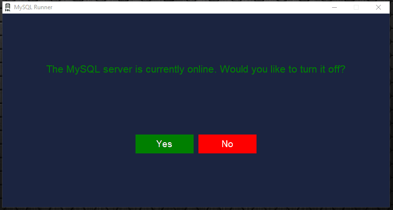
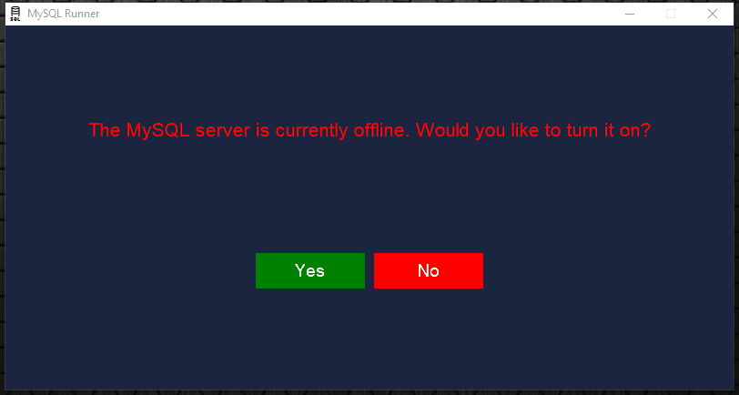

<div align='center'>
<h1>MySQL Runner</h1>
</div>
<h2>A script designed to run the MySQL server on a Windows machine.</h2>
<!--Problem description-->
<hr/>
<div align='center'>
<h3>🤔 What do you mean by 'MySQL Runner'? 🤔</h3>
</div>
<p>So, recently i was having an issue that every time i had to turn on the MySQL server on localhost, i had to type a command line on my command prompt, and i saw that this task could be automated, specially with a nice GUI. So that's the main purpose of this software: Automate the MySQL server management.</p>
<!--Requirements--->
<hr/>
<div align='center'>
<h3>📁 Requirements 📁</h3>
</div>
<p>In order to download this repository you are going to have installed on your machine:<br/>

- [x] Python 3.8 or superior
- [x] Psutil
- [x] Pyinstaller
- [x] Windows OS
- [x] MySQL 8.0 Database

The automation was basically designed for windows machines, because it tracks the 'MYSQL80' server service, if it's either running or stopped.<br/>
To install the two python packages, type the following code:

```python
# Installing the pyinstaller package
pip install pyinstaller
```

```python
# Installing the psutil package
pip install psutil
```
</p>
<!--Running--->
<hr/>
<div align='center'>
<h3>💻 Server is running 💻</h3>
</div>
<p>If the server is running, the program will tell you the current state, and ask if you want to turn it off.</p><br/>
<div align='center'>

</div>
<!--Stopped--->
<hr/>
<div align='center'>
<h3>💻 Server is stopped 💻</h3>
</div>
<p>If the server is stopped, the program will tell you the current state, and ask if you want to turn it on.</p><br/>
<div align='center'>

</div>
<!--Author-->
<hr/>
<div align='center'>
<h3>👾 Author 👾</h3>
</div>
<p>I hope you all like it, and it was made with ❤ by <a href='https://github.com/firminoneto11'>Firmino Neto.</a></p>
